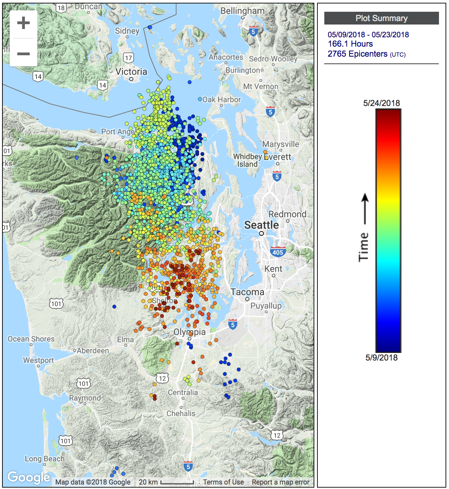
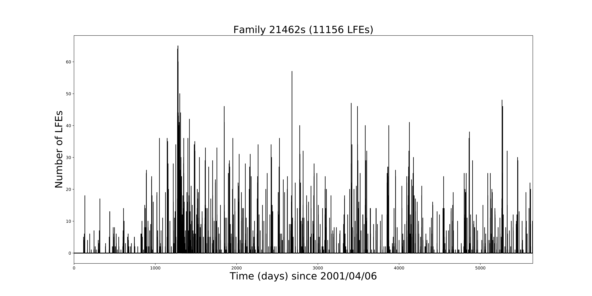
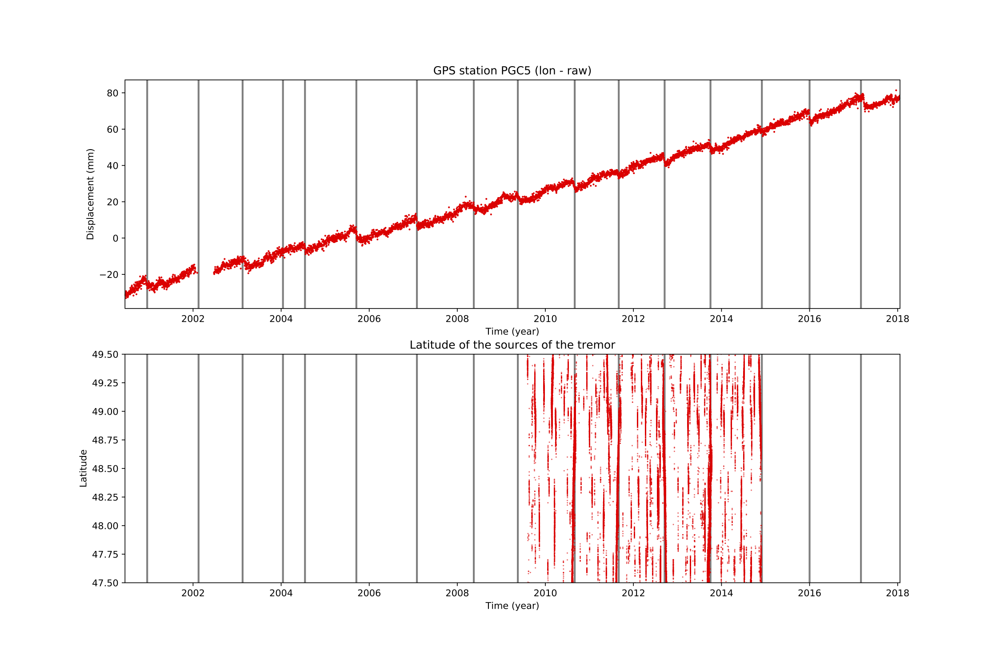
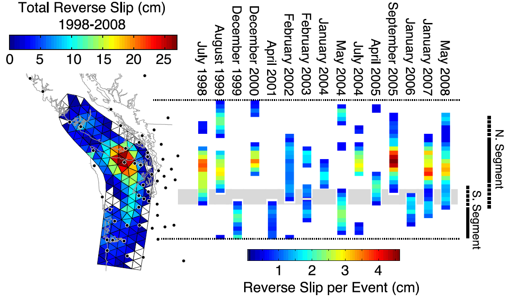

# TremorViz
The working goal of this project is to create a series of interactive data visualizations and/or dashboards that can be used to explore seismic data. These data can have X, Y, Z, and time information, so visualizing all of those dimensions can be challenging. Our hope is that by using interactive visualization tools, the user will be able to add or subtract complexity and move between scales.

## Collaborators on this project
Team members: Ariane Ducellier (project lead), Marcos Llobera, Jacob Deppen, Erik Fredrickson

Data science lead: TBD

## The problem
The aim of the project is to create a set of tools to visualize physical phenomena in 4D (latitude, longitude, depth, and time). The specific problem arises when we want to visualize at the same time two or more physical phenomena that are spatially and/or temporally correlated. What can we do in order to better see possible correlation patterns? Particularly, how do we deal with the case  when  the  types  of  information  that  we  have  about  the  time  and  localization  are  very different from one physical phenomenon to another?

## Application Example
Episodic Tremor and Slip (ETS) is a phenomenon that takes place mostly in subduction zones, when a geodetically detected slow slip event occurs concurrently with tectonic tremor. Tremor is  a  long  (several  seconds  to  many  minutes),  low  amplitude  seismic  signal,  with  emergent onsets, and an absence of clear impulsive phases. At least a portion of the tremor is made of small  low-frequency  earthquakes  (LFEs).  Slow  slip  events  can  be  detected  by  observing  GPS time  series.  Tremor  and  LFEs  can  be  detected,  and  their  source  can  be  located,  using recordings  of seismic  stations.  There  is  a  spatial  and  temporal  correlation  between  slow  slip, tremor, and LFEs.

## Sample data
### Tremor 
We can have two types of datasets:
1. For each five-minute-long time window when tremor is recorded, we have:
    - Latitude
    - Longitude
    - Approximate depth (depth is not very well known)
    
See Figure 1 for an example of visualization of tremor data.An example of this type of tremor dataset can be downloaded [here](https://pnsn.org/tremor) 

Figure 1: Map of the locations of the tremors recorded in the Olympic Peninsula between May  9th and May 23rd 2018. Each dot represents the location of the source of the tremor during a five-minute-long  time  window.  The  color  of  the  dot  represents  the  time  when  the  tremor  was recorded (Image from [here](https://pnsn.org/tremor)).

OR

2. For each tremor episode, we have:
    - Latitude
    - Longitude
    - Approximate depth
    - Beginning time
    - Duration
    
An example of this type of tremor dataset can be downloaded [here](http://www-solid.eps.s.u-tokyo.ac.jp/~idehara/wtd0/Welcome.html)

### Low Frequency Earthquakes 
They are divided into families. For each family, we have:
- Latitude
- Longitude
- Depth
- Timing of each earthquake
- (Sometimes magnitude of each earthquake)
    
See Figure 2 for an example of visualization of LFE data. A dataset of LFEs on the San Andreas Fault can be downloaded [here](https://agupubs.onlinelibrary.wiley.com/action/downloadSupplement?doi=10.1002%2F2017JB014047&file=jgrb52060-sup-0002-DataS1.txt).

Figure 2: Number of LFEs recorded per day as a function of time for a given family of LFEs located on the San Andreas Fault.

### Slow slip 
We can have both GPS data, and slip maps established using the GPS data.

#### GPS data
For  each  GPS  station,  we  have  the  latitude  and  the  longitude  of  the  station,  and  the  three components of the displacement in function of time (one value per day and per component).

See Figure 3 for an example of visualization of GPS data. 

Figure 3: Longitudinal displacement measured at the GPS station PGC5 (southern Vancouver Island) as a function of time. The grey bars represent the timing of ETS events.

An example of GPS dataset can be downloaded [here](http://www.panga.cwu.edu/data/bysite/Slip) maps. For  each  ETS  episode,  we  can  get  the  total  amount  of  slip  at  the  plate  boundary  from numerical modeling, but we have no indication about the time evolution of the slip.

See Figure 4 for an example of visualization of slow slip map.

Figure 4: Map of the total amount of slip observed during 16 ETS events between 1998 and 2008 (from Schmidt, D.A., and H. Gao (2010), Source parameters and time‐dependent slip distributions of slow slip events on the Cascadia subduction zone from 1998 to 2008, J. Geophys. Res., 115, B00A18, doi:10.1029/2008JB006045).

## Specific Questions
Improve Figure 1.

## Existing methods
Python visualization libraries bokeh or altair.

## Proposed methods/tools
We are going to try [altair](https://altair-viz.github.io/).

## Background reading
